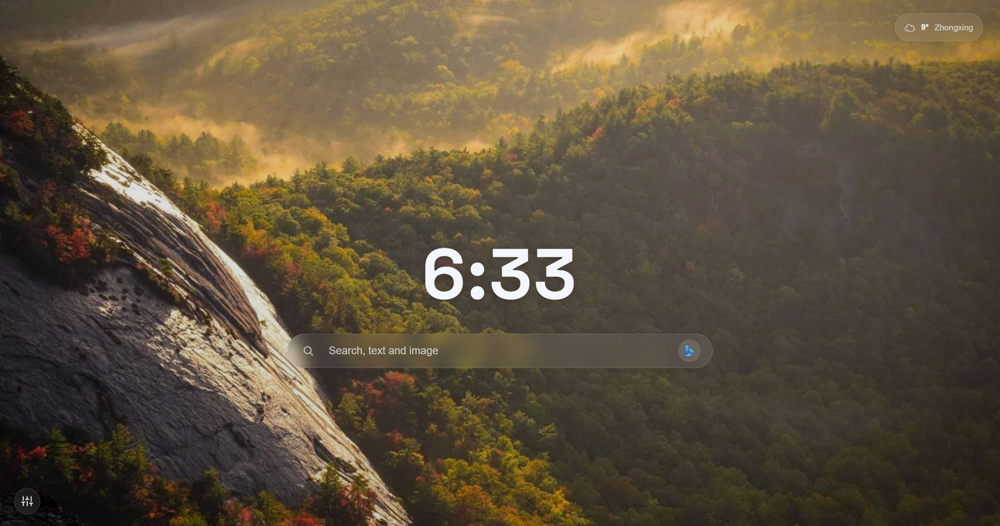

#  GlassTab

极简的 Chrome 新标签页扩展
  

English version: [README_en.md](README_en.md)

## 简介

GlassTab 用毛玻璃风格重新定义了 Edge 新标签页。没有多余的元素与臃肿的功能，只保留时间、搜索和天气，干净、清爽。

## 功能

### 极简时钟

页面中央的大字时钟，支持 24 小时制 / 12 小时制切换。

### 多引擎搜索

内置 Bing、Google、DuckDuckGo、Yandex、TinEye 五个搜索引擎。搜索栏右侧显示当前引擎图标，点击可循环切换。也可在设置中设置默认搜索引擎。

### 以图搜图

在搜索栏直接粘贴图片（Ctrl+V），搜索引擎会自动切换为图搜专用引擎（默认 Tineye），上传后跳转进行以图搜图。

在设置中可选择默认图搜引擎。

### 每日壁纸

支持三个壁纸源：
- **Pexels**（默认）— 按风景、自然、建筑等分类随机获取高质量摄影作品，左下角显示摄影师署名
- **Bing** — 每日必应壁纸
- **Picsum** — 随机图片

支持手动换壁纸、下载当前壁纸。

### 天气信息

基于地理定位自动获取当前天气，点击可展开查看体感温度、降雨量、风速及未来 5 天预报。支持手动切换城市。可在设置中关闭天气显示。

### 设置面板

点击左下角设置按钮，可配置：
- **双语支持** — 中文 / 英文
- **时间格式** — 24 小时制 / 12 小时制
- **天气** — 开启 / 关闭
- **默认搜索引擎** — Bing / Google / DuckDuckGo / Yandex
- **默认图搜引擎** — Google / Yandex / TinEye
- **壁纸来源** — Picsum / Bing / Pexels
- **换一张** — 随机更换壁纸
- **下载** — 下载当前壁纸

## 安装

1. 在 Release 页面下载或克隆本仓库；
2. 打开 Chrome，进入 `chrome://extensions/`；
3. 开启右上角「开发者模式」；
4. 点击「加载已解压的扩展程序」，选择项目文件夹；
5. （可选）配置 API Key，详见下文；
6. 欣赏你的新标签页！

## 配置

1. 将 `GlassTab` 目录下的 `config.example.js` 复制为 `config.js`
2. 填入你的 API Key：

| 配置项 | 说明 | 申请地址 | 是否必填 |
|-----|-----|-----| ------|
| `openWeatherMap` | OpenWeatherMap API Key | [openweathermap.org](https://openweathermap.org/api) | 可以不配置，天气显示可以在设置中关闭 | 
| `pexels` | Pexels API Key | [pexels.com/api](https://www.pexels.com/api/) | 可以不配置，未配置时将使用默认的背景，设置中选择其它源以获得每日壁纸功能 |
| `imgbb` | imgbb 图床 API Key（以图搜图） | [api.imgbb.com](https://api.imgbb.com/) | 可以不配置，未配置时以图搜图功能将默认使用谷歌图片搜索，此时若选择 yandex 或 Tineye，将自动跳转至对应网站进行手动上传 |

## 致谢

- 壁纸来自 [Pexels](https://www.pexels.com)、[Bing](https://www.bing.com)、[Lorem Picsum](https://picsum.photos)。
- 天气数据来自 [OpenWeatherMap](https://openweathermap.org)。
- 以图搜图由 [imgbb](https://imgbb.com) 提供图片托管。

## 许可

CC BY-NC 4.0 — 可自由使用和修改，但不得用于商业用途。详见 [LICENSE](LICENSE)。
